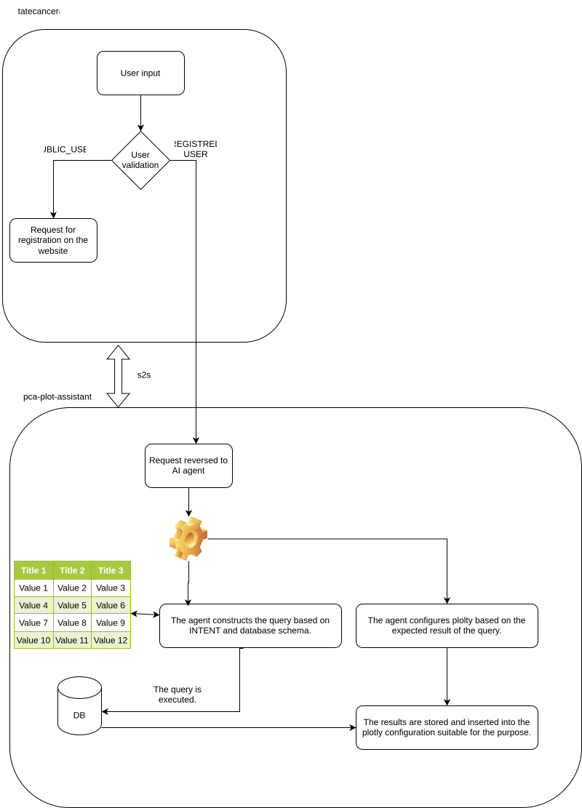

# PCA Plot Assistant

A backend service for the Prostate Cancer Atlas Plot Assistant, built with Node.js, TypeScript, and Prisma.

## Prerequisites

- **Docker** and **Docker Compose** installed on your machine.
- An existing PostgreSQL database (the application connects to a host database).

## Configuration

1. **Environment Variables**:
   Ensure you have a `.env` file in the root directory. It should contain the following variables to connect to your local PostgreSQL database:

   ```env
   PSQL_HOSTNAME=host.docker.internal
   PSQL_USER=your_db_user
   PSQL_PASSWORD=your_db_password
   PSQL_DBNAME=your_db_name
   PSQL_LOCAL_PORT=5432
   AI_PROVIDER=gemini
   AI_MODEL=gemini-3-pro-preview
   GOOGLE_GENAI_API_KEY=your_google_genai_key
   # Only required if AI_PROVIDER=openai
   OPENAI_API_KEY=your_openai_api_key
   # Only used if AI_PROVIDER=ollama
   OLLAMA_BASE_URL=http://ollama:11434
   ```

   AI configuration notes:
   - `AI_PROVIDER`: `gemini`, `openai` or `ollama`.
   - `AI_MODEL`: optional override. If not set, defaults are:
   - `gemini` -> `gemini-3-pro-preview`
   - `openai` -> `gpt-4.1-mini`
   - `ollama` -> `llama3.1:8b`
   - With `docker-compose.yml` in this repo, use `OLLAMA_BASE_URL=http://ollama:11434`.
   - First-time model download example: `docker compose exec ollama ollama pull llama3`.
   - If you run Ollama on host instead of container, use `OLLAMA_BASE_URL=http://host.docker.internal:11434`.

## Getting Started

### Using Docker Compose (Standard)

To start the application locally:

1. Build and start the container:
   ```bash
   docker compose up -d
   ```

2. The server will be available at `http://localhost:3000`.

3. To stop the service:
   ```bash
   docker compose down
   ```

### Database Schema Synchronization

If you need to update the Prisma schema from the existing database or regenerate the client manually:

1. Pull the latest schema from the database:
   ```bash
   docker exec -it pca_plot_assistant npx prisma db pull
   ```

2. Generate the Prisma Client:
   ```bash
   docker exec -it pca_plot_assistant npx prisma generate
   ```

### Using Antigravity Dev Containers (Recommended)

This project is configured with a **Dev Container** for a consistent development environment.

1. Open the project in **Antigravity**.
2. When prompted, click **"Reopen in Container"** (or use the command palette `Ctrl+Shift+P` -> `Dev Containers: Reopen in Container`).
3. Antigravity will build the container and set up the environment automatically:
   - Installs Node.js dependencies (`npm install`).
   - Generates the Prisma client (`npx prisma generate`).
   - Installs recommended extensions (Prisma, TypeScript).

## API Endpoints

- `GET /`: Health check message ("Hello Antigravity!").
- `GET /health`: Database connection check.

## Architecture Diagram



## Project Structure

- `src/`: Source code.
- `prisma/`: Database schema configuration.
- `.devcontainer/`: Configuration for Antigravity Dev Containers.
- `docker-compose.yml`: Service definition for local development.
- `Dockerfile`: Image definition for the application.
