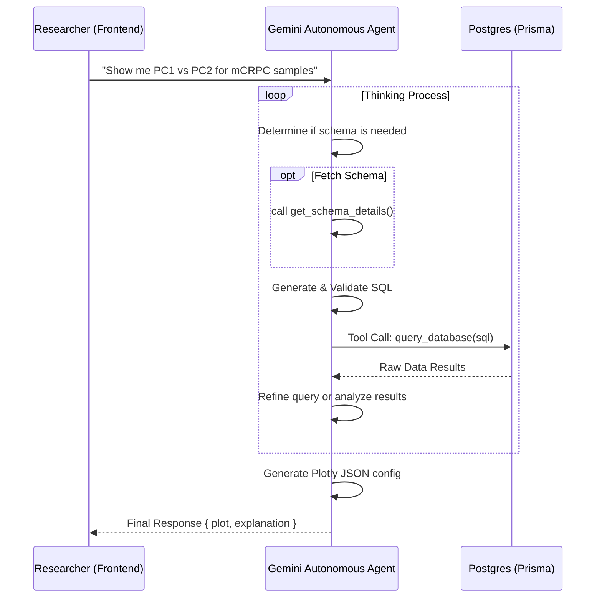

# Prostate Cancer Atlas (PCA) Plot Assistant

An autonomous AI agent designed to help researchers query, analyze, and visualize Prostate Cancer Atlas data. Built with Node.js, TypeScript, and Google Gemini.

## 🚀 The Autonomous Agent Architecture

Unlike traditional sequential workflows, this project uses a **Google-native Autonomous Agent**. The agent handles the entire lifecycle of a request: from understanding user intent and fetching database schema details, to executing safe SQL queries and generating final Plotly.js configurations.

### Flow Diagram



## 🛠 Prerequisites

- **Docker** and **Docker Compose** installed.
- Access to a PostgreSQL database.
- A **Google Generative AI API Key** (from [Google AI Studio](https://aistudio.google.com/)).

## ⚙️ Configuration

1. **Environment Variables**:
   Create a `.env` file in the root directory:

   ```env
   PSQL_HOSTNAME=host.docker.internal
   PSQL_USER=your_db_user
   PSQL_PASSWORD=your_db_password
   PSQL_DBNAME=your_db_name
   PSQL_LOCAL_PORT=5432
   
   # AI Configuration
   AI_PROVIDER=gemini
   GOOGLE_GENAI_API_KEY=your_google_genai_key
   ```

## 🏃 Getting Started

### Using Docker Compose

1. **Start the services**:
   ```bash
   docker compose up --build -d
   ```

2. **Access the API**:
   - Backend: `http://localhost:3000`
   - Frontend: `http://localhost:4200`

### Testing the Agent Locally

You can run a standalone test of the agent's logic without starting the full server:
```bash
npx ts-node src/test-agent.ts
```

## 🔒 Security

The agent uses a multi-layered security approach for database interactions:
1. **Word-based Validation**: All generated SQL is checked against forbidden keywords (DROP, DELETE, UPDATE, etc.).
2. **Read-Only Tools**: The agent's interface to the database is restricted to SELECT operations.
3. **Public Access Filter**: System instructions strictly enforce `user_id = 'PUBLIC_USER'` for bulk data queries unless otherwise authorized.

## 📦 Project Structure

- `src/services/ai-agent.service.ts`: The core autonomous loop and tool definitions.
- `src/services/ai-client.service.ts`: Google Gemini integration with tool-calling support.
- `src/index.ts`: Main HTTP server entry point.
- `pca-plot-frontend/`: Angular application for visualization.
