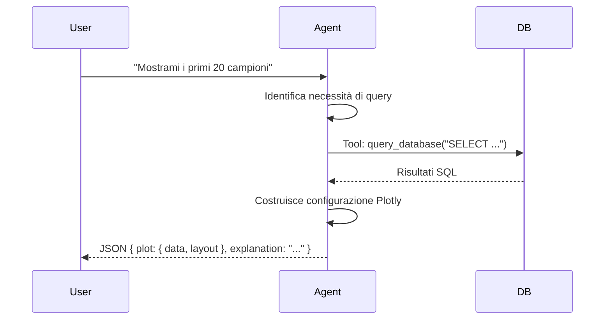

# Walkthrough: Agente AI Nativo Google per PCA

Ho implementato la trasformazione del workflow AI da un processo sequenziale manuale a un **Agente Autonomo** basato su Google Gemini.

## Cambiamenti Effettuati

### 1. Potenziamento AI Client
Ho aggiornato [ai-client.service.ts](file:///home/simone/work/pca-plot-assistant/src/services/ai-client.service.ts) per supportare le funzionalità avanzate di Gemini:
*   **Function Calling**: Permette al modello di invocare tool (funzioni TS) definiti nel backend.
*   **Structured Outputs**: Permette di forzare la risposta in un formato JSON specifico tramite schema.

### 2. Nuovo Servizio Agente
Ho creato [ai-agent.service.ts](file:///home/simone/work/pca-plot-assistant/src/services/ai-agent.service.ts) che implementa il loop agentico:
*   **Loop di Tool Calling**: Se Gemini decide di voler interrogare il database, richiama automaticamente la funzione `query_database`.
*   **Contesto Dinamico**: L'agente può chiedere lo schema del database se non lo conosce (`get_schema_details`).
*   **Output Consolidato**: Alla fine del loop, l'agente restituisce direttamente il JSON per Plotly.

## Come Funziona (Esempio)

L'agente non genera più codice JavaScript da eseguire; genera direttamente la configurazione del plot dopo aver analizzato i dati recuperati.

## Vantaggi Rispetto al Vecchio Metodo
1.  **Robustezza**: Se una query SQL è errata, l'agente riceve l'errore del database e può tentare di correggerla.
2.  **Mantenibilità**: Tutta la logica di decisione (cosa cercare e come visualizzarlo) è racchiusa in un'unica System Instruction.
3.  **Sicurezza**: Il tool `query_database` passa sempre per il validatore di sicurezza esistente.

## Verifica
È stato creato uno script di test in [test-agent.ts](file:///home/simone/work/pca-plot-assistant/src/test-agent.ts) per validare il loop agentico in ambiente locale.
